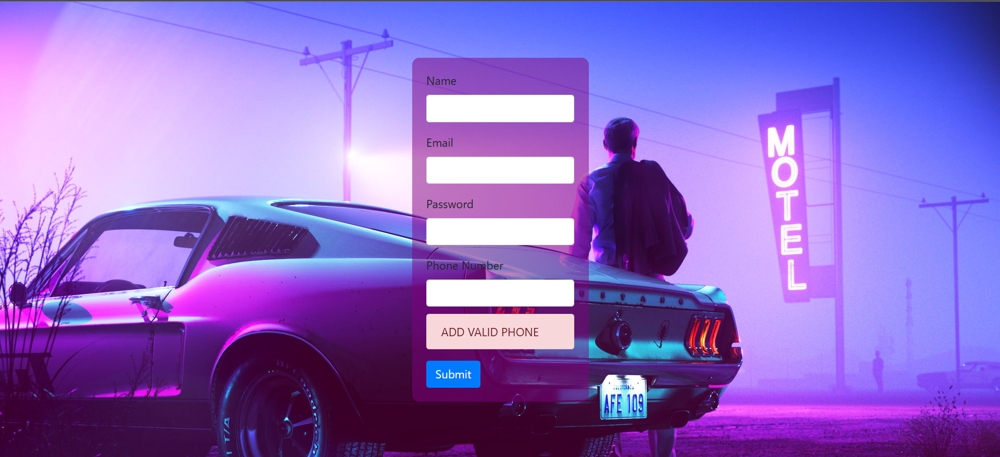

# Project Task 2

## Overview
This project involves validation and success criteria for a given task.

## Validation

## Success

## How to Use
1. Ensure all dependencies are installed.
2. Run the validation process.
3. Check the success criteria.

## License
This project is licensed under the MIT License.